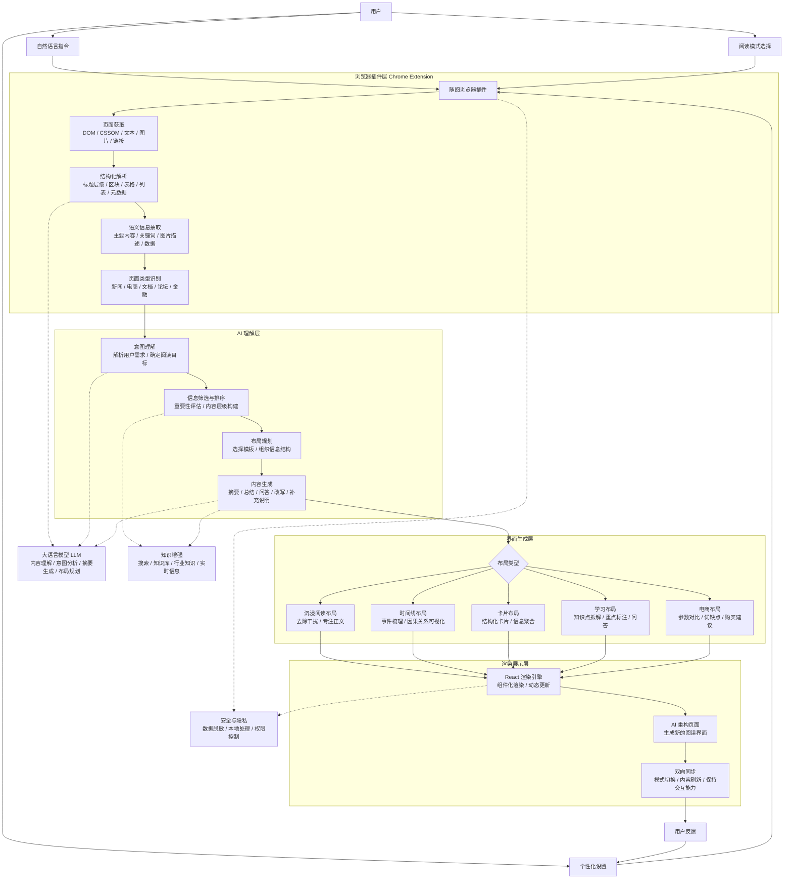

# 随阅（Readapt）

> 让网页适应用户，而不是让用户适应网页。

## 一、项目简介

**随阅（Readapt）** 是一款基于大语言模型的智能浏览器插件，能够理解网页内容与页面结构，并根据用户当前的阅读目标实时重构网页界面，让不同网站以更清晰、更高效、更符合个人习惯的方式呈现。

用户无需学习复杂配置，只需选择阅读模式或输入一句自然语言指令，例如：

- “帮我快速阅读”
- “改成学习模式”
- “整理成卡片布局”
- “只保留关键数据”

随阅会自动识别页面语义、分析信息层级、提取关键内容，并生成适合当前场景的阅读界面。

产品可应用于新闻阅读、技术文档、电商商品、金融资讯、论坛内容和企业后台等多种网页场景，让网页真正实现以用户为中心的个性化展示。

## 二、项目愿景

今天的网页通常由网站设计者决定信息如何组织，但每位用户访问网页的目的并不相同：

- 阅读新闻的用户希望快速掌握重点；
- 学习技术文档的用户希望看到知识结构和章节关系；
- 浏览商品的用户希望直接比较参数、优缺点和价格；
- 阅读金融资讯的用户更关注数据、事件和风险；
- 长文阅读者希望减少广告、推荐和视觉干扰。

随阅希望在网站原始界面与用户真实目标之间增加一层智能适配能力：

```text
原始网页 → 页面理解 → 用户意图 → 内容组织 → 个性化界面
```

## 三、核心痛点

### 1. 网页结构由网站决定，而不是由用户目标决定

同一个网页面对不同用户、不同任务时，往往仍然提供完全相同的信息结构。用户需要主动寻找重点，并适应每个网站不同的导航、排版和交互逻辑。

### 2. 信息干扰严重，关键内容获取成本高

广告、推荐流、悬浮窗口、复杂侧栏和重复信息不断分散用户注意力。传统阅读模式通常只能提取正文，难以处理技术文档、论坛、电商和数据型页面。

### 3. 传统 CSS 换肤无法理解页面语义

单纯覆盖 CSS 只能改变颜色、字体和间距，无法可靠判断哪些内容是正文、导航、评论、参数或辅助信息，也难以适配结构差异较大的网页。

### 4. 现有 AI 浏览工具缺少可控性

部分 AI 工具直接生成结果或连续操作页面，但用户难以确认 AI 对页面结构的判断是否正确。对于网页重构场景，需要具备预览、验证、确认、恢复和规则复用机制。

## 四、解决方案

随阅采用“网页解析—语义理解—界面生成—实时渲染”的四层架构。

### 1. 网页解析

浏览器插件获取当前网页的 DOM、标题结构、图片、表格、列表、链接及其他语义信息，并将不同网站转换为统一的页面结构表示。

### 2. 语义理解

AI 页面理解模块结合本地规则和大语言模型，分析：

- 当前网页类型；
- 页面中的主要内容与辅助内容；
- 信息的重要性和层级；
- 用户指令表达的阅读目标；
- 适合当前任务的布局方式。

### 3. 界面生成

布局生成模块根据网页内容和用户目标，动态选择或生成不同的阅读界面，例如：

- 沉浸阅读布局；
- 快速浏览布局；
- 学习模式；
- 卡片布局；
- 时间线布局；
- 文档双栏布局；
- 电商参数对比布局。

### 4. 实时渲染

浏览器插件在不要求网站改造的情况下完成页面重排，并尽可能保留原网页的链接、内容和交互能力。

页面无需刷新即可切换模式。用户关闭插件、取消预览或切换模板时，原始页面结构可以恢复。

## 五、关键创新点

### 1. 自然语言驱动的阅读界面

用户不需要理解 CSS、DOM 或网页规则，只需描述自己的阅读目标，系统即可规划内容重点和布局形式。

### 2. 内容理解与界面重构结合

随阅不只生成摘要，也不只是修改网页颜色，而是将内容理解结果直接转化为可交互的阅读界面。

### 3. 结构规则、布局模板与视觉主题解耦

系统将网页处理拆分为三个独立层级：

| 层级 | 职责 |
| --- | --- |
| 结构规则 | 识别页头、导航、正文、侧栏、评论等页面区域 |
| 布局模板 | 决定内容以单栏、双栏、卡片或时间线等方式呈现 |
| 视觉主题 | 控制颜色、字体、字号、间距和其他视觉表现 |

这种设计使同一个视觉主题可以应用于不同布局，也使同一个布局能够适配不同网站。

### 4. 本地规则与 LLM 协同

常见页面优先使用本地规则完成结构分析，以降低等待时间和模型调用成本。对于结构复杂或本地分析置信度较低的页面，可选择使用 LLM 辅助判断。

分析结果可以保存为网站规则，后续访问相同 URL 模式时直接复用。

### 5. AI 结果可预览、可验证、可恢复

AI 生成的页面规则不会立即生效。用户可以：

- 查看 AI 识别出的页面区域；
- 对比原页面与重排预览；
- 确认后保存规则；
- 取消并恢复原页面；
- 在规则失效时回退到本地分析。

### 6. 个性化主题与分享模板

用户可以创建自己的阅读主题和分享卡片模板。划词后可在本地生成与当前主题匹配的分享图片，并复制到剪贴板。

## 六、典型应用场景

### 新闻阅读

- 自动提取核心事实；
- 隐藏广告和推荐内容；
- 生成摘要、事件时间线和关键人物关系；
- 在快速浏览与沉浸阅读之间切换。

### 技术文档

- 识别章节、导航、代码块和示例；
- 使用左侧目录、右侧正文的文档布局；
- 提炼知识点、注意事项和常见问题；
- 转换为学习模式并生成问答。

### 电商商品

- 聚合商品参数；
- 提取优缺点和适用人群；
- 将分散信息整理为卡片；
- 生成商品对比和购买建议。

### 金融资讯

- 突出关键数据和风险信息；
- 整理事件因果关系；
- 使用时间线展示重要节点；
- 将长篇资讯转换为快速浏览界面。

### 论坛与社区

- 区分主帖、回复和辅助信息；
- 将讨论内容按阅读顺序重新组织；
- 折叠低相关内容；
- 提取主要观点和分歧。

### 企业后台

- 根据用户角色调整信息密度；
- 突出当前任务相关字段；
- 降低复杂页面中的信息查找成本；
- 将常用信息组织为更清晰的工作视图。

## 七、目标价值

以下数据为项目希望通过后续用户测试验证的目标指标，而非当前已经完成的大规模实验结果。

### 阅读效率

- 网页平均阅读时间降低 **40%**；
- 用户定位目标信息的时间降低 **60%**；
- 长文阅读完成率提升 **30%**。

### 信息获取效率

- AI 自动摘要准确率达到 **90%+**；
- 页面重点识别准确率达到 **90%**；
- 页面结构识别准确率达到 **95%**。

### 用户体验

- 用户自定义阅读模式覆盖率达到 **80%**；
- 首次使用无需学习复杂配置，实现自然语言即操作；
- 同一网页支持多种阅读模式自由切换。

## 八、技术架构



## 九、核心处理流程

```text
用户指令或模式选择
        ↓
获取并解析当前网页
        ↓
识别页面类型与语义区域
        ↓
理解用户当前阅读目标
        ↓
筛选、排序并组织信息
        ↓
选择或生成布局模板
        ↓
应用个性化视觉主题
        ↓
实时渲染新的阅读界面
        ↓
收集反馈并复用页面规则
```

## 十、安全与隐私设计

- 常见网页优先在本地完成结构分析；
- LLM 为可选能力，用户可以自行配置模型供应商；
- AI 分析可仅发送裁剪后的页面结构摘要；
- 不发送 Cookie 和表单输入值；
- AI 生成的结构规则需要通过校验和用户确认；
- 分享卡片通过本地 Canvas 生成，不上传划词内容；
- 页面重排采用可恢复机制，用户可随时返回原页面。

## 十一、当前原型能力

当前原型已经实现或具备以下基础能力：

- Chrome 浏览器插件；
- 多种内置阅读主题；
- 用户自定义阅读主题；
- URL 级主题和结构规则；
- 本地页面结构识别；
- OpenAI-compatible 与 Anthropic 模型接入；
- 多模型供应商配置；
- AI 页面结构分析；
- AI 规则预览、校验和确认；
- 文章、文档、论坛和宽屏等布局模板；
- 可恢复的 DOM 页面重排；
- 广告与侧栏净化；
- 划词生成分享卡片；
- 用户自定义分享模板。

## 十二、后续规划

### 近期

- 增加自然语言指令入口；
- 增加快速阅读、学习、卡片和时间线模式；
- 支持摘要、知识点拆解和页面问答；
- 增加可视化元素选择器；
- 提升动态网页的结构规则稳定性。

### 中期

- 支持电商、金融等垂直页面模板；
- 增加用户反馈学习和规则自动修复；
- 支持配置导入、导出与跨设备同步；
- 建立社区主题和布局模板市场。

### 长期

- 建立跨网站的个人阅读偏好模型；
- 接入实时搜索、知识库和行业知识；
- 将随阅发展为用户与网页之间的智能界面层。

## 十三、一句话介绍

**随阅（Readapt）是一款能够理解网页和用户阅读目标，并实时生成个性化阅读界面的智能浏览器插件。**

## 十四、待确认内容

原始材料中包含“演示即生成工作流、跨系统录入、RPA、页面回归测试、MCP 和 CLI 复用”等浏览器自动化产品描述。这些内容与当前“智能阅读界面重构”的产品主线差异较大，因此暂未放入核心亮点。

如果这些能力确实属于随阅的后续规划，可以单独整理为“智能网页操作”模块；如果来自其他项目材料，建议在正式提交和答辩前删除，避免评委无法判断产品的核心定位。
